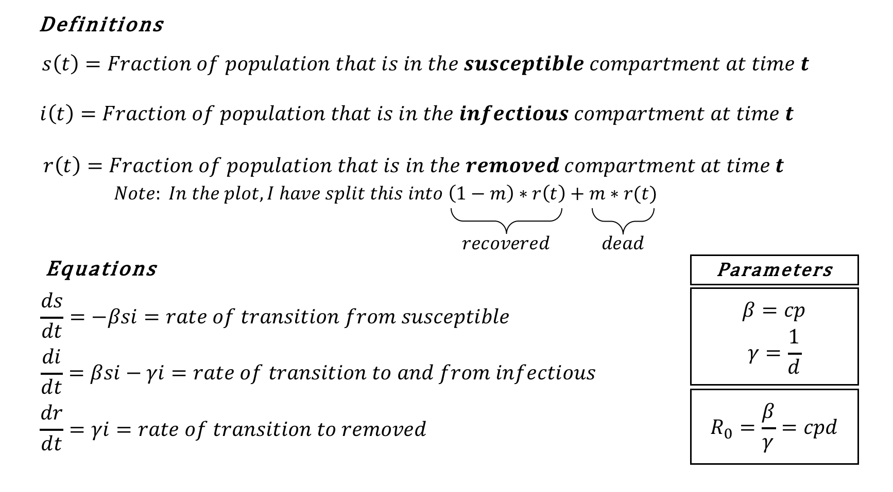

```{r setup, include=FALSE}
knitr::opts_chunk$set(echo = TRUE)
```

The model used for this simulation is an example of a [compartmental model](https://en.wikipedia.org/wiki/Compartmental_models_in_epidemiology), in which the population is divided into compartments, or disease states. Here, those states are **S**usceptible, **I**nfected, and **R**emoved (recovered or dead). Individuals transition between the states according to transition rates, which we can express as a set of differential equations (see below).

The key parameters governing the dynamics of the infected are \(\beta\) and \(\gamma\), which are determined by your inputs: $c$, $p$, and $d$. \(\beta\) is the expected number of infections per infected individual per day, and \(\gamma\) is the recovery rate. The ratio of these two is more commonly known as the basic reproduction number, *R~0~*!

There are a few key assumptions for this model. Beginning with the most unrealistic:

* The population is homogeneous. Every susceptible individual is equally likely to become infected; every infected person is equally likely to transmit, recover, or die from the disease.

* Once an individual has the disease and is no longer infectious, they cannot infect or be infected again. They are referred to as ‘removed’ because they no longer affect the dynamics of the susceptible and infected populations.

* Removal occurs, on average, on the $d$-th day of infection. At this point, either individuals recover or they die (at a rate of $m$).

